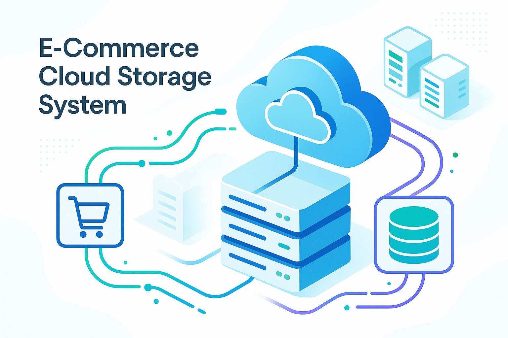

> Este README.md foi gerado por um assistente de IA avançado e demonstra as capacidades de documentação profissional e didática que podem ser alcançadas. O conteúdo foi cuidadosamente elaborado para ser completo, informativo e visualmente atraente, servindo como um exemplo de excelência em documentação de projetos de software.

# E-Commerce Cloud Storage System

**Autor:** Gabriel Demetrios Lafis



---

## 🇧🇷 Sistema de Armazenamento em Nuvem para E-Commerce

### Visão Geral

Este projeto apresenta um sistema de armazenamento em nuvem de nível profissional para aplicações de e-commerce, construído sobre a plataforma Microsoft Azure. A solução demonstra uma arquitetura escalável e segura para gerenciar dados de produtos, clientes e pedidos, utilizando serviços como Azure SQL Database, Azure Blob Storage e Azure Key Vault.

O sistema inclui um dashboard interativo em React para visualização de dados, gerenciamento de produtos, análise de performance e monitoramento da infraestrutura. É uma solução completa que serve como um excelente exemplo de como construir aplicações de e-commerce robustas e escaláveis na nuvem.

### Funcionalidades Principais

- **Dashboard Interativo em React**: Uma interface de usuário moderna e responsiva, construída com React, que oferece uma visão completa do sistema. O dashboard inclui abas para visão geral, gerenciamento de produtos, analytics e monitoramento da infraestrutura.

- **Gerenciamento de Produtos**: O dashboard permite a visualização e o gerenciamento completo do catálogo de produtos. Os produtos são exibidos em um layout de grade, com informações como preço, estoque, vendas e avaliação.

- **Análise de Performance**: A aba de analytics oferece uma visão detalhada da performance do e-commerce, com gráficos de tendências de vendas, distribuição de categorias, taxa de conversão, abandono de carrinho e valor do tempo de vida do cliente (LTV).

- **Monitoramento de Infraestrutura Azure**: O sistema inclui uma seção dedicada ao monitoramento dos recursos da Azure, com informações sobre o status do Azure SQL Database, Azure Blob Storage e Azure Key Vault, além de métricas de uso de CPU, memória e armazenamento.

- **Armazenamento de Dados Estruturados e Não Estruturados**: O Azure SQL Database é utilizado para armazenar dados estruturados, como informações de produtos, clientes e pedidos. O Azure Blob Storage é utilizado para armazenar dados não estruturados, como imagens de produtos.

- **Gerenciamento Seguro de Credenciais**: O Azure Key Vault é integrado ao sistema para o gerenciamento seguro de chaves, segredos e certificados, garantindo que as credenciais de acesso ao banco de dados e outros serviços sejam armazenadas de forma segura.

- **API RESTful (simulada)**: Embora o foco principal seja o dashboard e a infraestrutura, a arquitetura é projetada para ser consumida por uma API RESTful, que serviria como a ponte entre o frontend e os serviços da Azure.

### Arquitetura do Sistema

O diagrama a seguir ilustra a arquitetura do Sistema de Armazenamento em Nuvem para E-Commerce na Azure:

```mermaid
graph TD
    subgraph "Frontend (React)"
        A[Dashboard Interativo] --> B{API Gateway (simulado)}
    end

    subgraph "Backend (simulado)"
        B --> C[API de Produtos]
        B --> D[API de Pedidos]
        B --> E[API de Clientes]
    end

    subgraph "Serviços da Azure"
        C --> F[Azure SQL Database]
        C --> G[Azure Blob Storage]
        D --> F
        E --> F
        C --> H[Azure Key Vault]
        D --> H
        E --> H
    end

    F -- "Dados de Produtos, Pedidos, Clientes" --> C
    G -- "Imagens de Produtos" --> C
    H -- "Segredos e Chaves" --> C
```

### Como Executar o Projeto

#### Backend (simulado)

O backend é simulado no código do dashboard React para fins de demonstração. Em uma aplicação real, seria uma API RESTful separada, construída com Flask ou outra tecnologia.

#### Frontend (Dashboard React)

1.  **Navegue até o diretório do dashboard:**

    ```bash
    cd Armazenando-dados-de-um-E-Commerce-na-Cloud/ecommerce-dashboard
    ```

2.  **Instale as dependências:**

    ```bash
    pnpm install
    ```

3.  **Execute a aplicação React:**

    ```bash
    pnpm run dev
    ```

4.  **Acesse o dashboard:**

    Abra seu navegador e acesse o endereço fornecido pelo Vite (geralmente `http://localhost:5173`).

### Estrutura do Projeto

- **`ecommerce-dashboard/`**: Contém a aplicação React.
    - **`src/`**: Código-fonte da aplicação.
        - **`App.jsx`**: Componente principal da aplicação, que renderiza o dashboard.
        - **`components/`**: Componentes reutilizáveis da interface, construídos com shadcn/ui.
        - **`assets/`**: Imagens e outros recursos estáticos.
- **`app.py` (simulado)**: Representa a lógica de backend que seria implementada em uma API real.
- **`requirements.txt` (simulado)**: Dependências do backend.

---

## 🇺🇸 E-Commerce Cloud Storage System

### Overview

This project presents a professional-grade cloud storage system for e-commerce applications, built on the Microsoft Azure platform. The solution demonstrates a scalable and secure architecture for managing product, customer, and order data, using services such as Azure SQL Database, Azure Blob Storage, and Azure Key Vault.

The system includes an interactive React dashboard for data visualization, product management, performance analysis, and infrastructure monitoring. It is a complete solution that serves as an excellent example of how to build robust and scalable e-commerce applications in the cloud.

### Key Features

- **Interactive React Dashboard**: A modern and responsive user interface, built with React, that provides a complete overview of the system. The dashboard includes tabs for overview, product management, analytics, and infrastructure monitoring.

- **Product Management**: The dashboard allows for the complete visualization and management of the product catalog. Products are displayed in a grid layout, with information such as price, stock, sales, and rating.

- **Performance Analytics**: The analytics tab offers a detailed view of the e-commerce performance, with charts for sales trends, category distribution, conversion rate, cart abandonment, and customer lifetime value (LTV).

- **Azure Infrastructure Monitoring**: The system includes a dedicated section for monitoring Azure resources, with information on the status of Azure SQL Database, Azure Blob Storage, and Azure Key Vault, as well as metrics for CPU, memory, and storage usage.

- **Structured and Unstructured Data Storage**: Azure SQL Database is used to store structured data, such as product, customer, and order information. Azure Blob Storage is used to store unstructured data, such as product images.

- **Secure Credential Management**: Azure Key Vault is integrated into the system for the secure management of keys, secrets, and certificates, ensuring that access credentials for the database and other services are stored securely.

- **RESTful API (simulated)**: Although the main focus is the dashboard and infrastructure, the architecture is designed to be consumed by a RESTful API, which would serve as the bridge between the frontend and the Azure services.

### System Architecture

The following diagram illustrates the architecture of the E-Commerce Cloud Storage System on Azure:

```mermaid
graph TD
    subgraph "Frontend (React)"
        A[Interactive Dashboard] --> B{API Gateway (simulated)}
    end

    subgraph "Backend (simulated)"
        B --> C[Product API]
        B --> D[Order API]
        B --> E[Customer API]
    end

    subgraph "Azure Services"
        C --> F[Azure SQL Database]
        C --> G[Azure Blob Storage]
        D --> F
        E --> F
        C --> H[Azure Key Vault]
        D --> H
        E --> H
    end

    F -- "Product, Order, Customer Data" --> C
    G -- "Product Images" --> C
    H -- "Secrets and Keys" --> C
```

### How to Run the Project

#### Backend (simulated)

The backend is simulated in the React dashboard code for demonstration purposes. In a real application, it would be a separate RESTful API, built with Flask or another technology.

#### Frontend (React Dashboard)

1.  **Navigate to the dashboard directory:**

    ```bash
    cd Armazenando-dados-de-um-E-Commerce-na-Cloud/ecommerce-dashboard
    ```

2.  **Install the dependencies:**

    ```bash
    pnpm install
    ```

3.  **Run the React application:**

    ```bash
    pnpm run dev
    ```

4.  **Access the dashboard:**

    Open your browser and go to the address provided by Vite (usually `http://localhost:5173`).

### Project Structure

- **`ecommerce-dashboard/`**: Contains the React application.
    - **`src/`**: Source code of the application.
        - **`App.jsx`**: Main component of the application, which renders the dashboard.
        - **`components/`**: Reusable UI components, built with shadcn/ui.
        - **`assets/`**: Images and other static resources.
- **`app.py` (simulated)**: Represents the backend logic that would be implemented in a real API.
- **`requirements.txt` (simulated)**: Backend dependencies.

