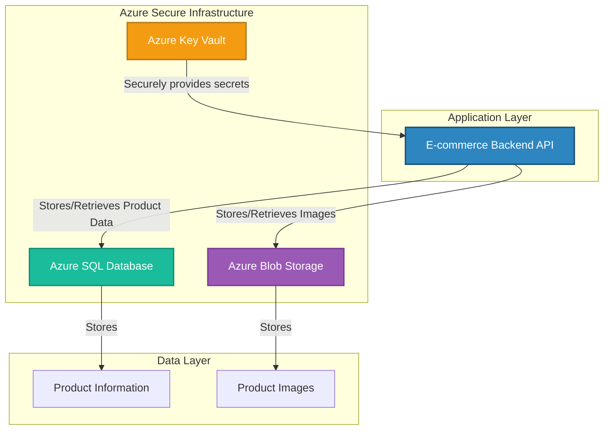
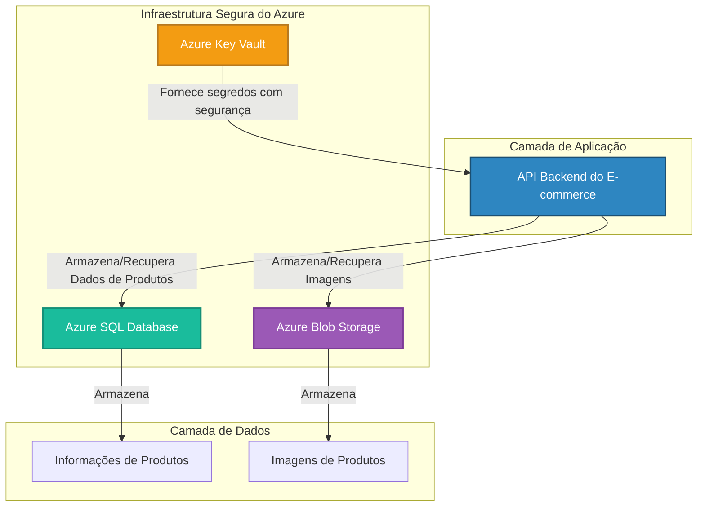

_**Note**: This project was developed by Gabriel Demetrios Lafis._

# E-Commerce Data Storage on Azure Cloud

---

## 🇬🇧 English

### 📋 Description

This project implements a complete and secure data storage solution for an e-commerce platform using Microsoft Azure cloud services. The architecture is designed to handle product information and associated images in a scalable, reliable, and secure manner, forming the foundational backend for a modern online store.

The solution leverages **Azure SQL Database** for structured product data (such as name, description, and price) and **Azure Blob Storage** for unstructured data, specifically product images. All resources are managed within a dedicated **Azure Resource Group** for organizational efficiency and cost tracking. A key security feature is the integration with **Azure Key Vault** to ensure that sensitive credentials are never hard-coded or exposed.

### 🏛️ Architecture

The architecture is designed for security and scalability, separating application logic from sensitive data and providing a clear path for future expansion into a microservices-based approach.



### ✨ Features

- **Secure Credential Management**: Utilizes **Azure Key Vault** to store and manage database connection strings and storage account keys, eliminating security risks.
- **Scalable Data Storage**: Employs **Azure SQL Database** and **Azure Blob Storage**, both of which can scale independently to meet business demands.
- **Organized Resource Management**: All Azure resources are neatly organized within a single **Resource Group**.
- **Robust Backend Logic**: A Python application using `pyodbc` and `azure-storage-blob` handles all data transactions securely.
- **Complete CRUD Operations**: Provides endpoints for creating, reading, updating, and deleting products and their images.

### 🛠️ Tech Stack

- **Cloud Platform**: Microsoft Azure
- **Database**: Azure SQL Database
- **Blob Storage**: Azure Blob Storage
- **Security**: Azure Key Vault
- **Backend**: Python
- **Key Libraries**: `pyodbc`, `azure-storage-blob`, `azure-identity`, `python-dotenv`

### 🚀 Getting Started

#### Prerequisites

- An active **Azure Subscription**.
- **Python 3.8+**.
- **Azure CLI** installed and authenticated (`az login`).

#### Installation & Configuration

1.  **Clone the Repository**:
    ```bash
    git clone https://github.com/galafis/Armazenando-dados-de-um-E-Commerce-na-Cloud.git
    cd Armazenando-dados-de-um-E-Commerce-na-Cloud
    ```

2.  **Set up Azure Resources**:
    - **Resource Group**: Create a resource group to hold all project resources.
    - **Azure SQL Database**: Provision a new SQL server and database.
    - **Azure Blob Storage**: Create a new storage account and a container within it (e.g., `product-images`).
    - **Azure Key Vault**: Create a Key Vault instance to store your secrets.

3.  **Configure Azure Key Vault**:
    - Add your SQL connection string and Blob Storage connection string as **secrets** in your Key Vault.
    - Grant your local user or a service principal access to these secrets.

4.  **Set up Python Environment**:
    ```bash
    python -m venv venv
    source venv/bin/activate  # On Windows: venv\Scripts\activate
    pip install -r requirements.txt
    ```

5.  **Configure Environment Variables**:
    Create a `.env` file in the root directory and add the URL of your Azure Key Vault:
    ```
    KEY_VAULT_URL=https://your-key-vault-name.vault.azure.net/
    ```

6.  **Run the Application**:
    ```bash
    python app.py
    ```

### 💻 Usage

The application provides a set of functions to manage products. Below is an example of how to use the core logic:

```python
from app import add_product, get_product

# Example: Add a new product
image_path = "path/to/local/image.jpg"
product_id = add_product("Laptop Pro", "A powerful new laptop.", 1499.99, image_path)
print(f"New product created with ID: {product_id}")

# Example: Retrieve a product
product = get_product(product_id)
print(f"Retrieved Product: {product['Name']}, Price: ${product['Price']}")
print(f"Image URL: {product['ImageUrl']}")
```

### 📄 License

This project is licensed under the MIT License. See the [LICENSE](LICENSE) file for details.

---

## 🇧🇷 Português

### 📋 Descrição

Este projeto implementa uma solução completa e segura de armazenamento de dados para uma plataforma de e-commerce utilizando os serviços em nuvem da Microsoft Azure. A arquitetura foi projetada para gerenciar informações de produtos e suas imagens associadas de forma escalável, confiável e segura, formando o backend fundamental para uma loja online moderna.

A solução utiliza o **Azure SQL Database** para dados estruturados de produtos (como nome, descrição e preço) e o **Azure Blob Storage** para dados não estruturados, especificamente as imagens dos produtos. Todos os recursos são gerenciados dentro de um **Grupo de Recursos do Azure** dedicado para eficiência organizacional e controle de custos. Uma característica chave de segurança é a integração com o **Azure Key Vault** para garantir que credenciais sensíveis nunca sejam codificadas ou expostas.

### 🏛️ Arquitetura

A arquitetura foi projetada para segurança e escalabilidade, separando a lógica da aplicação de dados sensíveis e fornecendo um caminho claro para futura expansão em uma abordagem baseada em microsserviços.



### ✨ Funcionalidades

- **Gerenciamento Seguro de Credenciais**: Utiliza o **Azure Key Vault** para armazenar e gerenciar connection strings de banco de dados e chaves de conta de armazenamento, eliminando riscos de segurança.
- **Armazenamento de Dados Escalável**: Emprega o **Azure SQL Database** e o **Azure Blob Storage**, ambos capazes de escalar independentemente para atender às demandas do negócio.
- **Gerenciamento Organizado de Recursos**: Todos os recursos do Azure são organizados de forma limpa em um único **Grupo de Recursos**.
- **Lógica de Backend Robusta**: Uma aplicação Python utilizando `pyodbc` e `azure-storage-blob` lida com todas as transações de dados de forma segura.
- **Operações CRUD Completas**: Fornece endpoints para criar, ler, atualizar e deletar produtos e suas imagens.

### 🛠️ Tecnologias Utilizadas

- **Plataforma de Nuvem**: Microsoft Azure
- **Banco de Dados**: Azure SQL Database
- **Armazenamento de Blobs**: Azure Blob Storage
- **Segurança**: Azure Key Vault
- **Backend**: Python
- **Bibliotecas Principais**: `pyodbc`, `azure-storage-blob`, `azure-identity`, `python-dotenv`

### 🚀 Como Começar

#### Pré-requisitos

- Uma **Assinatura do Azure** ativa.
- **Python 3.8+**.
- **Azure CLI** instalado e autenticado (`az login`).

#### Instalação e Configuração

1.  **Clonar o Repositório**:
    ```bash
    git clone https://github.com/galafis/Armazenando-dados-de-um-E-Commerce-na-Cloud.git
    cd Armazenando-dados-de-um-E-Commerce-na-Cloud
    ```

2.  **Configurar Recursos no Azure**:
    - **Grupo de Recursos**: Crie um grupo de recursos para conter todos os recursos do projeto.
    - **Azure SQL Database**: Provisione um novo servidor e banco de dados SQL.
    - **Azure Blob Storage**: Crie uma nova conta de armazenamento e um contêiner dentro dela (ex: `product-images`).
    - **Azure Key Vault**: Crie uma instância do Key Vault para armazenar seus segredos.

3.  **Configurar o Azure Key Vault**:
    - Adicione sua connection string do SQL e a connection string do Blob Storage como **segredos** no seu Key Vault.
    - Conceda ao seu usuário local ou a uma entidade de serviço acesso a esses segredos.

4.  **Configurar Ambiente Python**:
    ```bash
    python -m venv venv
    source venv/bin/activate  # No Windows: venv\Scripts\activate
    pip install -r requirements.txt
    ```

5.  **Configurar Variáveis de Ambiente**:
    Crie um arquivo `.env` no diretório raiz e adicione a URL do seu Azure Key Vault:
    ```
    KEY_VAULT_URL=https://seu-key-vault-name.vault.azure.net/
    ```

6.  **Executar a Aplicação**:
    ```bash
    python app.py
    ```

### 💻 Uso

A aplicação fornece um conjunto de funções para gerenciar produtos. Abaixo está um exemplo de como usar a lógica principal:

```python
from app import add_product, get_product

# Exemplo: Adicionar um novo produto
image_path = "caminho/para/imagem/local.jpg"
product_id = add_product("Laptop Pro", "Um novo e poderoso laptop.", 1499.99, image_path)
print(f"Novo produto criado com ID: {product_id}")

# Exemplo: Recuperar um produto
product = get_product(product_id)
print(f"Produto Recuperado: {product['Name']}, Preço: R${product['Price']}")
print(f"URL da Imagem: {product['ImageUrl']}")
```

### 📄 Licença

Este projeto está licenciado sob a Licença MIT. Veja o arquivo [LICENSE](LICENSE) para mais detalhes.

