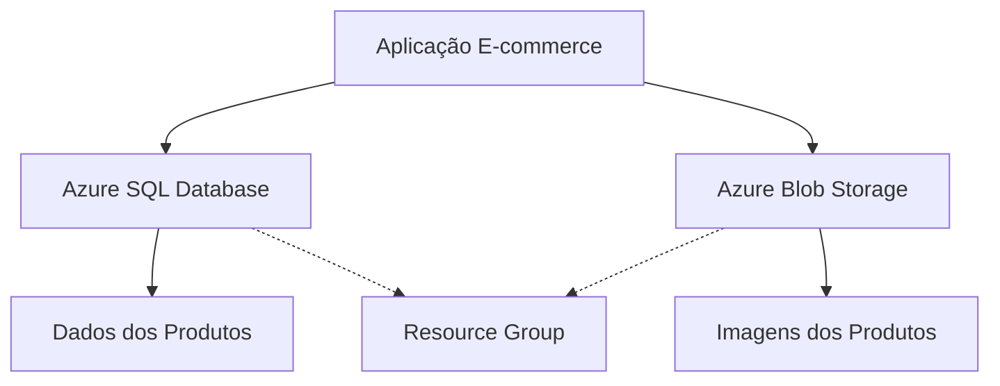

# Armazenando dados de um E-Commerce na Cloud Azure

Neste projeto, implementei uma solução completa para armazenamento de dados de um e-commerce utilizando os serviços da Microsoft Azure. O objetivo foi criar uma infraestrutura robusta, escalável e segura para gerenciar produtos e suas imagens na nuvem.

## Visão Geral da Solução

A solução implementada permite:

- Armazenar informações de produtos (nome, descrição, preço) em um banco de dados SQL na nuvem
- Salvar imagens dos produtos em um serviço de armazenamento de blobs
- Gerenciar os recursos de forma organizada através de Resource Groups
- Escalar os recursos conforme a necessidade do negócio

### Arquitetura da Solução



## Passo a Passo da Implementação

### 1. Criando um Resource Group e SQL Database

O primeiro passo foi criar um Resource Group para organizar todos os recursos relacionados ao projeto:

1. Acessei o [Portal Azure](https://portal.azure.com)
2. Naveguei até "Resource Groups" e cliquei em "Create"
3. Defini um nome significativo para o grupo (ex: "EcommerceResources")
4. Selecionei a região mais próxima para melhor desempenho
5. Adicionei tags para facilitar o gerenciamento de custos

Em seguida, criei o banco de dados SQL:

1. No portal Azure, busquei por "SQL Database"
2. Cliquei em "Create" e selecionei o Resource Group criado anteriormente
3. Configurei o servidor SQL (novo ou existente)
4. Escolhi o modelo de preços adequado para a carga de trabalho esperada
5. Configurei as opções de rede para garantir a segurança dos dados

### 2. Criando um Storage Account

Para armazenar as imagens dos produtos, criei um Storage Account:

1. No portal Azure, busquei por "Storage Account"
2. Cliquei em "Create" e selecionei o Resource Group criado anteriormente
3. Defini um nome único para o Storage Account
4. Escolhi a região mais próxima (idealmente a mesma do SQL Database)
5. Selecionei o nível de performance (Standard para a maioria dos casos)
6. Configurei as opções de redundância (LRS, GRS, ZRS) de acordo com as necessidades de disponibilidade

Após a criação do Storage Account, criei um contêiner específico para as imagens dos produtos:

1. Acessei o Storage Account criado
2. Naveguei até "Containers" e cliquei em "New container"
3. Nomeei o contêiner como "product-images"
4. Defini o nível de acesso público apropriado (Blob para permitir acesso direto às imagens)

### 3. Configurando o Banco de Dados e Criando a Tabela de Produtos

Com o banco de dados SQL criado, configurei a tabela para armazenar os produtos:

1. Conectei ao banco de dados usando o Azure Data Studio ou SQL Server Management Studio
2. Criei a tabela de produtos com a seguinte estrutura:

```sql
CREATE TABLE Products (
    ProductId INT PRIMARY KEY IDENTITY(1,1),
    Name NVARCHAR(100) NOT NULL,
    Description NVARCHAR(MAX),
    Price DECIMAL(18,2) NOT NULL,
    ImageUrl NVARCHAR(255),
    CreatedAt DATETIME DEFAULT GETDATE()
);
```

3. Configurei índices para otimizar as consultas mais frequentes:

```sql
CREATE INDEX IX_Products_Name ON Products(Name);
CREATE INDEX IX_Products_Price ON Products(Price);
```

4. Implementei políticas de segurança e backup para garantir a integridade dos dados

### 4. Implementando o Salvamento de Imagens no Blob Storage

Para integrar o upload de imagens com o Blob Storage, implementei o seguinte fluxo:

1. Quando um produto é cadastrado, a imagem é enviada para o Blob Storage
2. A URL da imagem é gerada e armazenada no campo ImageUrl da tabela Products
3. Ao exibir o produto, a aplicação utiliza a URL para mostrar a imagem

Exemplo de código para upload de imagem:

```csharp
// Exemplo de código para upload de imagem para o Blob Storage
public async Task<string> UploadProductImage(string productId, Stream imageStream, string contentType)
{
    // Obter referência para o contêiner de imagens
    BlobContainerClient containerClient = new BlobContainerClient(_storageConnectionString, "product-images");
    
    // Garantir que o contêiner existe
    await containerClient.CreateIfNotExistsAsync();
    
    // Criar um nome único para o blob
    string blobName = $"{productId}-{Guid.NewGuid().ToString()}{Path.GetExtension(contentType)}";
    
    // Obter referência para o blob
    BlobClient blobClient = containerClient.GetBlobClient(blobName);
    
    // Fazer upload da imagem
    await blobClient.UploadAsync(imageStream, new BlobHttpHeaders { ContentType = contentType });
    
    // Retornar a URL da imagem
    return blobClient.Uri.ToString();
}
```

## Benefícios da Solução

Ao implementar esta solução na Azure, obtive diversos benefícios:

1. **Escalabilidade**: Tanto o SQL Database quanto o Blob Storage podem escalar conforme o crescimento do negócio
2. **Disponibilidade**: Os serviços Azure oferecem alta disponibilidade com SLAs robustos
3. **Segurança**: Dados protegidos por criptografia em repouso e em trânsito
4. **Gerenciamento simplificado**: Recursos organizados em um único Resource Group
5. **Custo otimizado**: Pagamento apenas pelos recursos utilizados

## Insights e Possibilidades Futuras

Durante o desenvolvimento deste projeto, aprendi várias lições valiosas sobre a implementação de soluções na nuvem Azure:

1. **Arquitetura de Microserviços**: No futuro, posso evoluir esta solução para uma arquitetura de microserviços utilizando Azure Kubernetes Service (AKS) ou Azure Container Apps.

2. **Processamento Assíncrono**: Implementar Azure Functions para processar eventos como notificações de estoque baixo ou processamento de imagens em segundo plano.

3. **API Management**: Adicionar uma camada de API Management para expor os serviços de forma segura e controlada.

4. **Análise de Dados**: Integrar com serviços como Azure Synapse Analytics para obter insights de negócio a partir dos dados de vendas e comportamento do cliente.

5. **Autenticação e Autorização**: Implementar Azure AD B2C para gerenciar identidades de clientes de forma segura.

## Conclusão

A implementação de uma solução de e-commerce na nuvem Azure proporcionou uma base sólida e escalável para o armazenamento de dados de produtos e suas imagens. Com os serviços de Resource Group, SQL Database e Blob Storage, consegui criar uma infraestrutura que atende às necessidades atuais e está preparada para crescer junto com o negócio.

Este projeto representa apenas o início da jornada na nuvem. Com a vasta gama de serviços oferecidos pela Microsoft Azure, as possibilidades de evolução são praticamente ilimitadas.


## 📋 Descrição

Descreva aqui o conteúdo desta seção.


## 📦 Instalação

Descreva aqui o conteúdo desta seção.


## 💻 Uso

Descreva aqui o conteúdo desta seção.


## 📄 Licença

Descreva aqui o conteúdo desta seção.
