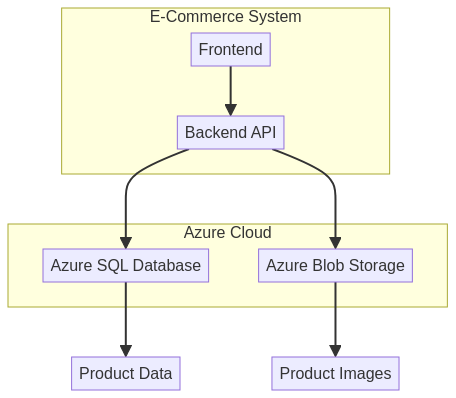

# E-Commerce Cloud Storage System

**Autor:** Gabriel Demetrios Lafis

[](https://python.org)
[](https://azure.microsoft.com)
[](https://azure.microsoft.com/services/storage/blobs/)

[](https://www.microsoft.com/sql-server)

[](LICENSE)
[](https://github.com/galafis/Armazenando-dados-de-um-E-Commerce-na-Cloud/stargazers)

[Ver Código no GitHub](https://github.com/galafis/Armazenando-dados-de-um-E-Commerce-na-Cloud) | [Visualizar no GitHub Pages](https://galafis.github.io/Armazenando-dados-de-um-E-Commerce-na-Cloud/)


## 📁 Estrutura do Projeto

```
📦 Armazenando-dados-de-um-E-Commerce-na-Cloud
├── 📂 ecommerce-dashboard/ # Frontend da aplicação (React)
│   ├── 📂 public/          # Arquivos públicos
│   ├── 📂 src/             # Código fonte do React
│   └── 📄 package.json     # Dependências do frontend
├── 📂 src/                 # Backend da aplicação (Python)
│   └── 📄 app.py           # Lógica principal do backend
├── 📄 .env.example         # Exemplo de variáveis de ambiente
├── 📄 requirements.txt     # Dependências Python do backend
├── 📄 README.md            # Este arquivo
└── 📄 LICENSE              # Licença do projeto
```

## 🇧🇷 Sistema de Armazenamento em Nuvem para E-Commerce

### Visão Geral

Este projeto demonstra um sistema de backend para e-commerce, focado no armazenamento seguro e eficiente de dados de produtos utilizando Azure SQL Database e Azure Blob Storage. A solução é projetada para ser escalável e segura, servindo como base para aplicações de e-commerce robustas na nuvem.


### Funcionalidades Principais

- **Armazenamento de Dados Estruturados:** Utiliza Azure SQL Database para armazenar informações de produtos, como nome, descrição, preço e URL da imagem.

- **Armazenamento de Dados Não Estruturados:** Integra Azure Blob Storage para o armazenamento eficiente de imagens de produtos, otimizando o acesso e a escalabilidade.

- **Gerenciamento de Produtos:** Permite adicionar, listar, recuperar, atualizar e excluir produtos do banco de dados, com suporte para upload de imagens associadas.

- **Modo de Simulação (Mock Mode):** Inclui um modo de simulação para desenvolvimento e testes locais, permitindo que o backend funcione sem a necessidade de conexões reais com Azure SQL Database e Azure Blob Storage.

- **Configuração via Variáveis de Ambiente:** As credenciais e configurações são gerenciadas através de variáveis de ambiente, facilitando a implantação e a segurança.

### Arquitetura do Sistema

O diagrama a seguir ilustra a arquitetura do sistema de backend do e-commerce:




### Como Executar o Projeto

#### Backend (Python)

1.  **Navegue até o diretório raiz do projeto:**
    ```shell
    cd Armazenando-dados-de-um-E-Commerce-na-Cloud
    ```

2.  **Crie e ative um ambiente virtual:**
    ```shell
    python3.11 -m venv venv_backend
    source venv_backend/bin/activate
    ```

3.  **Instale as dependências:**
    ```shell
    pip install -r requirements.txt
    ```

4.  **Configure as variáveis de ambiente:**
    Crie um arquivo `.env` no diretório `src/` com as seguintes variáveis (substitua pelos seus valores reais do Azure, ou deixe como `mock_...` para o modo de simulação):
    ```
    SQL_CONNECTION_STRING="Driver={ODBC Driver 18 for SQL Server};Server=tcp:<your_server>.database.windows.net,1433;Database=<your_database>;Uid=<your_username>;Pwd=<your_password>;Encrypt=yes;TrustServerCertificate=no;Connection Timeout=30;"
    BLOB_CONNECTION_STRING="DefaultEndpointsProtocol=https;AccountName=<your_account_name>;AccountKey=<your_account_key>;EndpointSuffix=core.windows.net"
    ```
    Para executar em modo de simulação, você pode omitir a criação do arquivo `.env` ou deixar os valores como `mock_...`.

5.  **Execute a aplicação:**
    ```shell
    python src/app.py
    ```
    O sistema será inicializado e você verá logs no console. Em modo de simulação, ele executará operações de exemplo.


#### Frontend (Dashboard React)

O frontend está localizado no diretório `ecommerce-dashboard/`. Para executá-lo:

1.  **Navegue até o diretório do frontend:**
    ```shell
    cd ecommerce-dashboard
    ```

2.  **Instale as dependências:**
    ```shell
    pnpm install
    ```

3.  **Execute a aplicação React:**
    ```shell
    pnpm run dev
    ```

4.  **Acesse o dashboard:**
    Abra seu navegador e acesse o endereço fornecido pelo Vite (geralmente `http://localhost:5173`).


## 🇺🇸 E-Commerce Cloud Storage System

### Overview

This project demonstrates a backend system for e-commerce, focused on secure and efficient product data storage using Azure SQL Database and Azure Blob Storage. The solution is designed to be scalable and secure, serving as a foundation for robust cloud e-commerce applications.


### Key Features

- **Structured Data Storage:** Uses Azure SQL Database to store product information such as name, description, price, and image URL.

- **Unstructured Data Storage:** Integrates Azure Blob Storage for efficient storage of product images, optimizing access and scalability.

- **Product Management:** Allows adding, listing, retrieving, updating, and deleting products from the database, with support for associated image uploads.

- **Mock Mode:** Includes a mock mode for local development and testing, allowing the backend to function without the need for real connections to Azure SQL Database and Azure Blob Storage.

- **Environment Variable Configuration:** Credentials and configurations are managed through environment variables, facilitating deployment and security.

### How to Run the Project

#### Backend (Python)

1.  **Navigate to the project root directory:**
    ```shell
    cd Armazenando-dados-de-um-E-Commerce-na-Cloud
    ```

2.  **Create and activate a virtual environment:**
    ```shell
    python3.11 -m venv venv_backend
    source venv_backend/bin/activate
    ```

3.  **Install dependencies:**
    ```shell
    pip install -r requirements.txt
    ```

4.  **Configure environment variables:**
    Create a `.env` file in the `src/` directory with the following variables (replace with your actual Azure values, or leave as `mock_...` for mock mode):
    ```
    SQL_CONNECTION_STRING="Driver={ODBC Driver 18 for SQL Server};Server=tcp:<your_server>.database.windows.net,1433;Database=<your_database>;Uid=<your_username>;Pwd=<your_password>;Encrypt=yes;TrustServerCertificate=no;Connection Timeout=30;"
    BLOB_CONNECTION_STRING="DefaultEndpointsProtocol=https;AccountName=<your_account_name>;AccountKey=<your_account_key>;EndpointSuffix=core.windows.net"
    ```
    To run in mock mode, you can omit creating the `.env` file or leave the values as `mock_...`.

5.  **Run the application:**
    ```shell
    python src/app.py
    ```
    The system will initialize, and you will see logs in the console. In mock mode, it will execute example operations.


#### Frontend (React Dashboard)

The frontend is located in the `ecommerce-dashboard/` directory. To run it:

1.  **Navigate to the frontend directory:**
    ```shell
    cd ecommerce-dashboard
    ```

2.  **Install dependencies:**
    ```shell
    pnpm install
    ```

3.  **Run the React application:**
    ```shell
    pnpm run dev
    ```

4.  **Access the dashboard:**
    Open your browser and go to the address provided by Vite (usually `http://localhost:5173`).

### System Architecture

The following diagram illustrates the e-commerce backend system architecture:


## 📊 Tecnologias Utilizadas

- **Backend:** Python, Flask
- **Cloud:** Microsoft Azure
- **Database:** Azure SQL Database
- **Storage:** Azure Blob Storage
- **Monitoring:** Azure Monitor, Application Insights

## 🤝 Contribuindo

Contribuições são bem-vindas! Por favor, leia o [CONTRIBUTING.md](CONTRIBUTING.md) para detalhes sobre nosso código de conduta e o processo para enviar pull requests.

## 📄 Licença

Este projeto está licenciado sob a Licença MIT - veja o arquivo [LICENSE](LICENSE) para detalhes.

## 👨‍💻 Autor

**Gabriel Demetrios Lafis**
- GitHub: [@galafis](https://github.com/galafis)
- LinkedIn: [Gabriel Demetrios Lafis](https://linkedin.com/in/gabriel-lafis)

---


