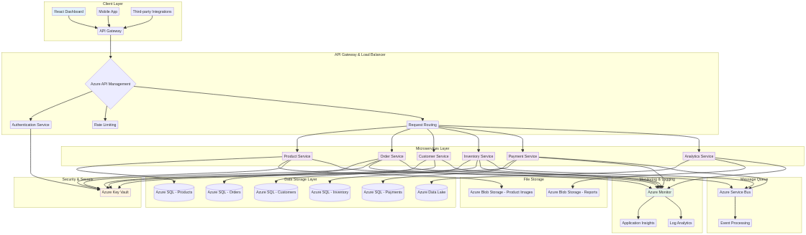
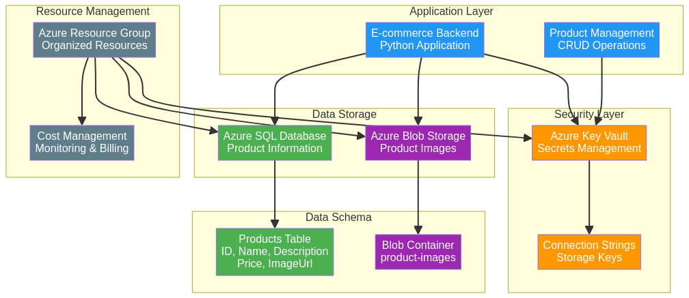

# E-Commerce Cloud Storage System

**Autor:** Gabriel Demetrios Lafis

[](https://python.org)
[](https://azure.microsoft.com)
[](https://azure.microsoft.com/services/storage/blobs/)
[](https://azure.microsoft.com/services/key-vault/)
[](https://www.microsoft.com/sql-server)
[](https://reactjs.org)
[](LICENSE)
[](https://github.com/galafis/Armazenando-dados-de-um-E-Commerce-na-Cloud/stargazers)

[Ver Código no GitHub](https://github.com/galafis/Armazenando-dados-de-um-E-Commerce-na-Cloud) | [Visualizar no GitHub Pages](https://galafis.github.io/Armazenando-dados-de-um-E-Commerce-na-Cloud/)


## 📁 Estrutura do Projeto

```
📦 E-Commerce Cloud Storage System
├── 📂 src/                 # Código fonte principal
│   ├── 📂 api/             # Endpoints da API
│   ├── 📂 models/          # Modelos de dados
│   ├── 📂 services/        # Lógica de negócio
│   └── 📂 utils/           # Utilitários
├── 📂 tests/               # Testes unitários e integração
├── 📂 docs/                # Documentação (API.md)
├── 📂 frontend/            # Interface do usuário
│   ├── 📂 components/      # Componentes React
│   ├── 📂 assets/          # Imagens e estilos
│   └── 📂 public/          # Arquivos públicos
├── 📂 config/              # Configurações (.env.example)
└── 📄 requirements.txt     # Dependências Python
```

## 🇧🇷 Sistema de Armazenamento em Nuvem para E-Commerce

### Visão Geral

Este projeto apresenta um sistema de armazenamento em nuvem de nível profissional para aplicações de e-commerce, construído sobre a plataforma Microsoft Azure. A solução demonstra uma arquitetura escalável e segura para gerenciar dados de produtos, clientes e pedidos, utilizando serviços como Azure SQL Database, Azure Blob Storage e Azure Key Vault.

O sistema inclui um dashboard interativo em React para visualização de dados, gerenciamento de produtos, análise de performance e monitoramento da infraestrutura. É uma solução completa que serve como um excelente exemplo de como construir aplicações de e-commerce robustas e escaláveis na nuvem.

### Funcionalidades Principais

- **Dashboard Interativo em React:** Uma interface de usuário moderna e responsiva, construída com React, que oferece uma visão completa do sistema. O dashboard inclui abas para visão geral, gerenciamento de produtos, analytics e monitoramento da infraestrutura.

- **Gerenciamento de Produtos:** O dashboard permite a visualização e o gerenciamento completo do catálogo de produtos. Os produtos são exibidos em um layout de grade, com informações como preço, estoque, vendas e avaliação.

- **Análise de Performance:** A aba de analytics oferece uma visão detalhada da performance do e-commerce, com gráficos de tendências de vendas, distribuição de categorias, taxa de conversão, abandono de carrinho e valor do tempo de vida do cliente (LTV).

- **Monitoramento de Infraestrutura Azure:** O sistema inclui uma seção dedicada ao monitoramento dos recursos da Azure, com informações sobre o status do Azure SQL Database, Azure Blob Storage e Azure Key Vault, além de métricas de uso de CPU, memória e armazenamento.

- **Armazenamento de Dados Estruturados e Não Estruturados:** O Azure SQL Database é utilizado para armazenar dados estruturados, como informações de produtos, clientes e pedidos. O Azure Blob Storage é utilizado para armazenar dados não estruturados, como imagens de produtos.

- **Gerenciamento Seguro de Credenciais:** O Azure Key Vault é integrado ao sistema para o gerenciamento seguro de chaves, segredos e certificados, garantindo que as credenciais de acesso ao banco de dados e outros serviços sejam armazenadas de forma segura.

- **API RESTful (simulada):** Embora o foco principal seja o dashboard e a infraestrutura, a arquitetura é projetada para ser consumida por uma API RESTful, que serviria como a ponte entre o frontend e os serviços da Azure.

### Arquitetura do Sistema

O diagrama a seguir ilustra a arquitetura de microsserviços do Sistema de Armazenamento em Nuvem para E-Commerce na Azure:



O diagrama abaixo detalha a infraestrutura de armazenamento e segurança:




### Como Executar o Projeto

#### Backend (simulado)

O backend é simulado no código do dashboard React para fins de demonstração. Em uma aplicação real, seria uma API RESTful separada, construída com Flask ou outra tecnologia.

#### Frontend (Dashboard React)

1. **Navegue até o diretório do dashboard:**
   ```shell
   cd Armazenando-dados-de-um-E-Commerce-na-Cloud/ecommerce-dashboard
   ```

2. **Instale as dependências:**
   ```shell
   pnpm install
   ```

3. **Execute a aplicação React:**
   ```shell
   pnpm run dev
   ```

4. **Acesse o dashboard:**
   Abra seu navegador e acesse o endereço fornecido pelo Vite (geralmente `http://localhost:5173`).

## 🇺🇸 E-Commerce Cloud Storage System

### Overview

This project presents a professional-level cloud storage system for e-commerce applications, built on the Microsoft Azure platform. The solution demonstrates a scalable and secure architecture for managing product, customer, and order data, utilizing services such as Azure SQL Database, Azure Blob Storage, and Azure Key Vault.

The system includes an interactive React dashboard for data visualization, product management, performance analysis, and infrastructure monitoring. It's a complete solution that serves as an excellent example of how to build robust and scalable e-commerce applications in the cloud.

### Key Features

- **Interactive React Dashboard:** A modern and responsive user interface built with React that provides a comprehensive view of the system. The dashboard includes tabs for overview, product management, analytics, and infrastructure monitoring.

- **Product Management:** The dashboard allows for complete visualization and management of the product catalog. Products are displayed in a grid layout with information such as price, stock, sales, and rating.

- **Performance Analysis:** The analytics tab offers a detailed view of e-commerce performance with sales trend charts, category distribution, conversion rate, cart abandonment, and customer lifetime value (LTV).

- **Azure Infrastructure Monitoring:** The system includes a dedicated section for monitoring Azure resources, with information about the status of Azure SQL Database, Azure Blob Storage, and Azure Key Vault, plus CPU, memory, and storage usage metrics.

- **Structured and Unstructured Data Storage:** Azure SQL Database is used to store structured data such as product, customer, and order information. Azure Blob Storage is used to store unstructured data such as product images.

- **Secure Credential Management:** Azure Key Vault is integrated into the system for secure management of keys, secrets, and certificates, ensuring that database access credentials and other services are stored securely.

- **RESTful API (simulated):** While the main focus is the dashboard and infrastructure, the architecture is designed to be consumed by a RESTful API that would serve as the bridge between the frontend and Azure services.

### System Architecture

The following diagram illustrates the microservices architecture of the E-Commerce Cloud Storage System on Azure:


The diagram below details the storage and security infrastructure:


### How to Run the Project

#### Backend (simulated)

The backend is simulated in the React dashboard code for demonstration purposes. In a real application, it would be a separate RESTful API built with Flask or another technology.

#### Frontend (React Dashboard)

1. **Navigate to the dashboard directory:**
   ```shell
   cd Armazenando-dados-de-um-E-Commerce-na-Cloud/ecommerce-dashboard
   ```

2. **Install dependencies:**
   ```shell
   pnpm install
   ```

3. **Run the React application:**
   ```shell
   pnpm run dev
   ```

4. **Access the dashboard:**
   Open your browser and go to the address provided by Vite (usually `http://localhost:5173`).

## 📊 Tecnologias Utilizadas

- **Frontend:** React 18+, Vite, Tailwind CSS, Lucide React
- **Backend (simulado):** Python, Flask
- **Cloud:** Microsoft Azure
- **Database:** Azure SQL Database
- **Storage:** Azure Blob Storage
- **Security:** Azure Key Vault
- **Monitoring:** Azure Monitor, Application Insights

## 🤝 Contribuindo

Contribuições são bem-vindas! Por favor, leia o [CONTRIBUTING.md](CONTRIBUTING.md) para detalhes sobre nosso código de conduta e o processo para enviar pull requests.

## 📄 Licença

Este projeto está licenciado sob a Licença MIT - veja o arquivo [LICENSE](LICENSE) para detalhes.

## 👨‍💻 Autor

**Gabriel Demetrios Lafis**
- GitHub: [@galafis](https://github.com/galafis)
- LinkedIn: [Gabriel Demetrios Lafis](https://linkedin.com/in/gabriel-lafis)

---


